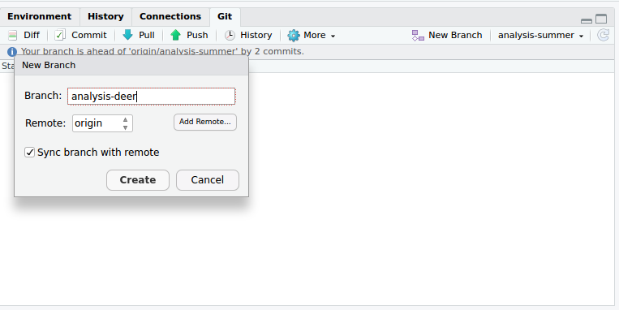
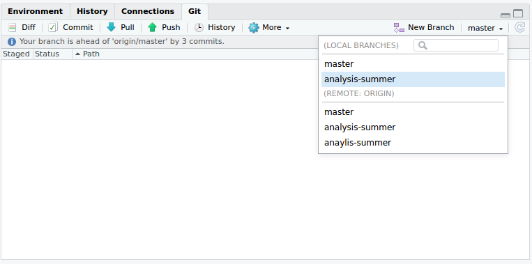
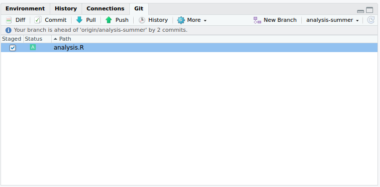
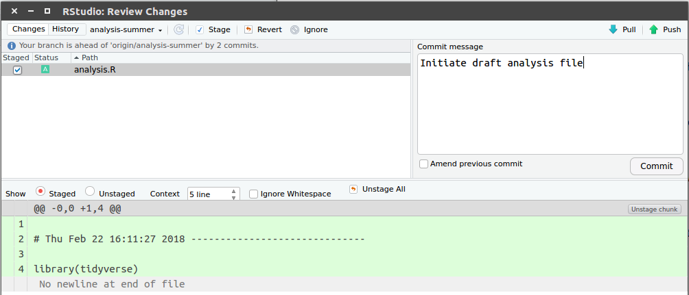
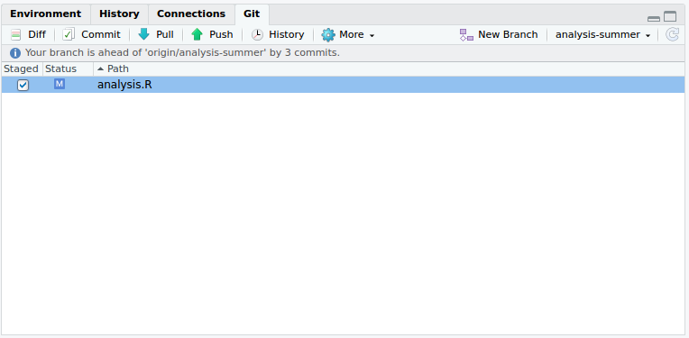
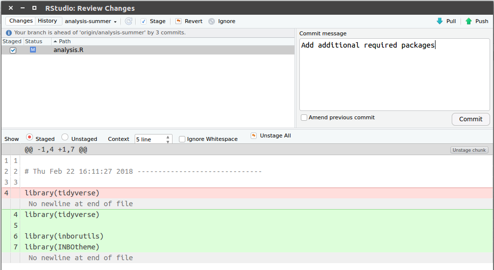
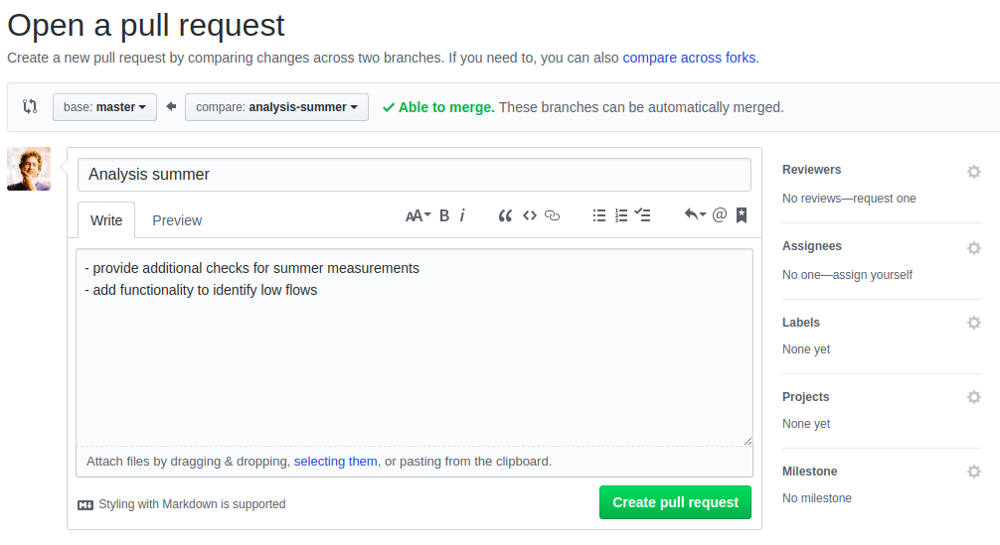
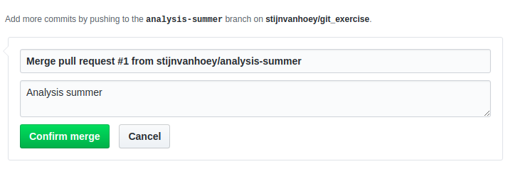

# BEFORE I START WORKING

## STEP 1: 

**Choose your option:**

### OPTION 1A: *I'll make a new branch to work with*  
Create a new topic branch from master

Make sure you are working on the master branch:


Update the master branch to make sure it is aligned with the remote master: Click `Pull`:


Create a new branch: click on `New branch` and fill in a branch name:


### **OPTION 1B**:  *I already have a branch I want to continue working on*:  

Switch to existing topic branch:


Update the topic branch to make sure is is aligned with the remote master: 
In the Git shell, type:
```
git pull origin master
```


# WHILE EDITING

## STEP 2.x: adapt in md, R-code,... (multiple times!)

### Add new files

Stage the new file with checkbox and click `Commit`


Provide clear and understandable message about adaptations


### Change files:

Stage the adaptations with checkbox and click `Commit`


Provide clear and understandable message about adaptations



## STEP 3: Push your changes to GitHub.

Update the remote version of the topic branch. Click `Push`:
 

# EDITS ON BRANCH ARE READY

## STEP 4: Pull request to add your changes to the current master. 

Update the remote version of the topic branch. Click `Push`:


Go to your repo on Github.com and click the `Compare & pull request` button. 


Add information about the Pull request, add reviewers, labels,... Finally, `Create pull request`:


## STEP 5: Code review!

You and collaborators can make comments about the edits, review the code and adapt if required (create additional commits and `Push` them to GitHub) .

If everything is ok, click the  `Merge pull request`:


followed by `Confirm merge`:



Delete the online branch after merge, since obsolete, click `Delete branch`


## STEP 6: Update the master branch on my PC

Make sure you are working on the master branch:


Remove the local branch, since obsolete. In the Git shell, type:
```
git branch -d analysis-script
```


Update the local master branch: Click `Pull`:

